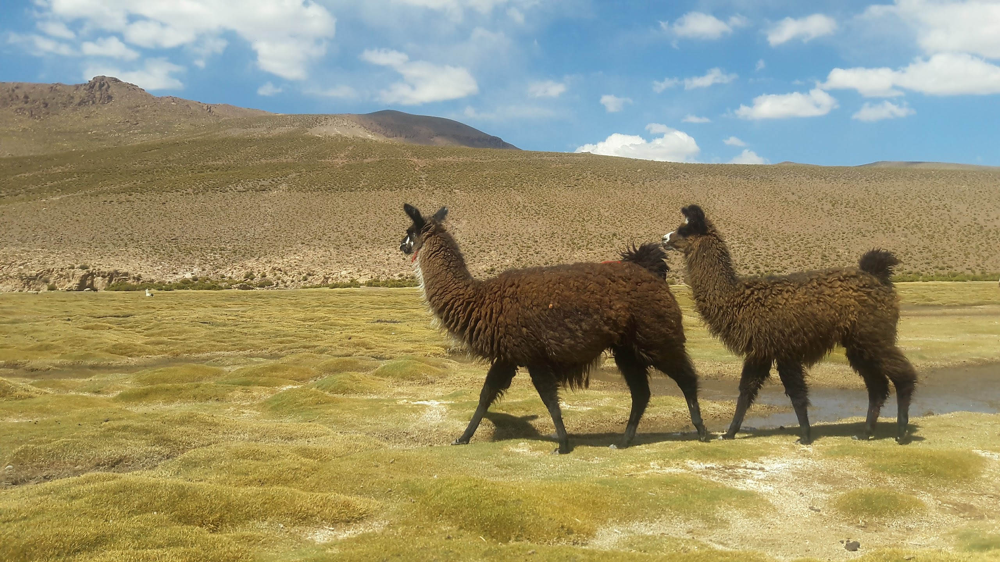

### Hi, I'm Pedro.
I am 31 Brazilian/Italian and since 2022 I live in Berlin with my beautiful Family.
I am married to Una and have a 2 year old daughter, Mel. I am a chemical Engineer and since 2018 I have been working as a software developer. I entered the area mainly because:
- I found a job as a tech recruiter
- During that job I discovered my passion for tech
- Decided I would study and as soon as I felt comfortable applied to Developer positions

After that everythign that happened to my carrer was driven by my passion for learning and as well because I wanted to leave Brasil and live in Europe.

## What have I been working lately with

##### Backend:

##### Frontend:

##### General tools:

### What I really like to study and deepen myself

